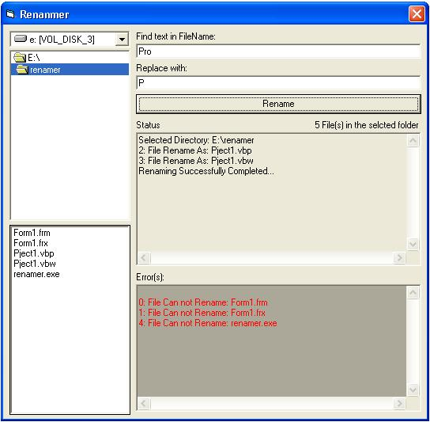



## Bulk Renamer

### Description

if you were wondering to rename a specific text in a file name only of huge bulk of files then the solution is here. Rename bulk of file in selected folder as well as a specific string in a file name. for example, you want to remove b from abc.txt then write b in find text field and left the replace field blank, then the file name will be renamed as ac.txt

Visit: http://mwisoft.co.nr
 
### More Info
 

             |
---                |---
**Submitted On**   |2008-10-27 07:30:02
**By**             |[Task Bar \- Desktop Enhancement](https://github.com/Planet-Source-Code/PSCIndex/blob/master/ByAuthor/task-bar-desktop-enhancement.md)
**Level**          |Beginner
**User Rating**    |4.0 (8 globes from 2 users)
**Compatibility**  |VB 4\.0 \(32\-bit\), VB 5\.0, VB 6\.0
**Category**       |[Files/ File Controls/ Input/ Output](https://github.com/Planet-Source-Code/PSCIndex/blob/master/ByCategory/files-file-controls-input-output__1-3.md)
**World**          |[Visual Basic](https://github.com/Planet-Source-Code/PSCIndex/blob/master/ByWorld/visual-basic.md)
**Archive File**   |[Bulk\_Renam21321010272008\.zip](https://github.com/Planet-Source-Code/task-bar-desktop-enhancement-bulk-renamer__1-71307/archive/master.zip)

